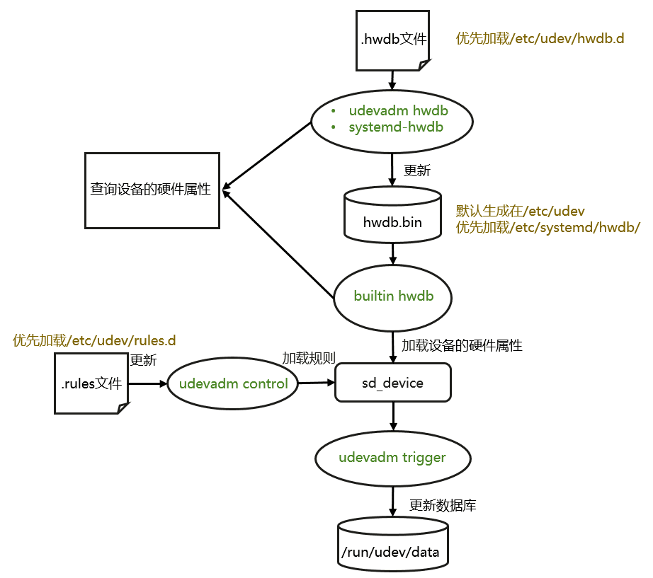
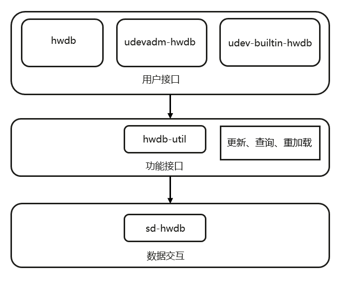

# 0002-hwdb支持

## 概述
- 	hwdb（硬件数据库）：是一个由modalias风格的键(key)与udev属性风格的值(value)组成的 key-value 文本数据库，包含了设备的名称、供应商、型号、ID等信息。这些信息可以使udev用于识别和配置硬件设备，以及在系统启动时自动加载相应的驱动程序。

- modalias：Linux系统中的一种文件，里面存储了用于描述设备的属性和标识符。它通常位于/sys目录下，以设备的路径和名称作为文件名，例如/sys/devices/LNXSYSTM\:00/LNXSYBUS\:00/ACPI0010\:00/LNXCPU\:02/modalias

## 示例说明
- 查看20-acpi-vendor.hwdb，找到其中一个modalias规则为acpi:LNX*的key，其对应的value为ID_VENDOR_FROM_DATABASE=The Linux Foundation
    ```
    acpi:LNX*:
    ID_VENDOR_FROM_DATABASE=The Linux Foundation
    ```
- 执行udevadm内置命令查找设备的硬件信息。我们可以看到当前查找的设备的modalias为acpi:LNXCPU: 而20-acpi-vendor.hwdb中匹配到了对应的modalias并赋予了该设备对应的硬件属性值。
    ```
    # udevadm test-builtin hwdb /devices/LNXSYSTM:00/LNXSYBUS:00/ACPI0010:00/LNXCPU:02
    Trying to open "/etc/systemd/hwdb/hwdb.bin"...
    Trying to open "/etc/udev/hwdb.bin"...
    === trie on-disk ===
    tool version:          249
    file size:        11124638 bytes
    header size             80 bytes
    strings            2374798 bytes
    nodes              8749760 bytes
    Load module index
    Found cgroup on /sys/fs/cgroup/systemd, legacy hierarchy
    Found container virtualization none.
    Loaded timestamp for '/usr/lib/systemd/network'.
    Parsed configuration file /usr/lib/systemd/network/99-default.link
    Created link configuration context.
    LNXCPU:02: hwdb modalias key: "acpi:LNXCPU:"
    ID_VENDOR_FROM_DATABASE=The Linux Foundation
    Unload module index
    Unloaded link configuration context.
    ```
## 使用场景
- 硬件设备识别和配置：系统可以使用hwdb中的信息来识别硬件设备，并自动加载相应的驱动程序和配置文件，从而使硬件设备能够正常工作。
- 硬件设备管理：系统管理员可以使用hwdb中的信息来管理硬件设备，例如禁用某些设备或更改设备的默认配置。

## 使用场景举例
- 如下是通过设备的hwdb属性以及结合udev的规则来配置设备的电源开关。/usr/lib/udev/rules.d/60-autosuspend.rules配置了规则：当识别到设备中存在了hwdb的属性ID_AUTOSUSPEND==1，且设备存在power/control属性时，udev会将设备的power/control属性配置为auto。
    ```
    # Enable autosuspend if hwdb says so. Here we are relying on
    # the hwdb import done earlier based on MODALIAS.
    ENV{ID_AUTOSUSPEND}=="1", TEST=="power/control", \
    ATTR{power/control}="on"
    ```
- 我们使用hwdb查询/devices/pci0000:00/0000:00:01.2/usb1设备的属性时发现此设备存在ID_AUTOSUSPEND且为1，如下：
    ```
    # udevadm test-builtin hwdb /devices/LNXSYSTM:00/LNXSYBUS:00/ACPI0010:00/LNXCPU:02
    Trying to open "/etc/systemd/hwdb/hwdb.bin"...
    Trying to open "/etc/udev/hwdb.bin"...
    === trie on-disk ===
    tool version:          249
    file size:        11124638 bytes
    header size             80 bytes
    strings            2374798 bytes
    nodes              8749760 bytes
    Load module index
    Found cgroup on /sys/fs/cgroup/systemd, legacy hierarchy
    Found container virtualization none.
    Loaded timestamp for '/usr/lib/systemd/network'.
    Parsed configuration file /usr/lib/systemd/network/99-default.link
    Created link configuration context.
    LNXCPU:02: hwdb modalias key: "acpi:LNXCPU:"
    ID_VENDOR_FROM_DATABASE=The Linux Foundation
    Unload module index
    Unloaded link configuration context.
    ```
- 最终我们可以看到/devices/pci0000:00/0000:00:01.2/usb1设备的power/control属性被设置成了auto。这意味着，当设备不再被使用时，系统会自动将其挂起以节省能源。这个规则的作用是优化系统的能源管理，减少不必要的能源消耗。
    ```
    # udevadm info -a -p /devices/pci0000:00/0000:00:01.2/usb1

    Udevadm info starts with the device specified by the devpath and then
    walks up the chain of parent devices. It prints for every device
    found, all possible attributes in the udev rules key format.
    A rule to match, can be composed by the attributes of the device
    and the attributes from one single parent device.

    looking at device '/devices/pci0000:00/0000:00:01.2/usb1':
        KERNEL=="usb1"
        SUBSYSTEM=="usb"
        DRIVER=="usb"
        ATTR{authorized}=="1"
        ATTR{authorized_default}=="1"
        ATTR{avoid_reset_quirk}=="0"
        ATTR{bConfigurationValue}=="1"
        ATTR{bDeviceClass}=="09"
        ATTR{bDeviceProtocol}=="00"
        ATTR{bDeviceSubClass}=="00"
        ATTR{bMaxPacketSize0}=="64"
        ATTR{bMaxPower}=="0mA"
        ATTR{bNumConfigurations}=="1"
        ATTR{bNumInterfaces}==" 1"
        ATTR{bcdDevice}=="0510"
        ATTR{bmAttributes}=="e0"
        ATTR{busnum}=="1"
        ATTR{configuration}==""
        ATTR{devnum}=="1"
        ATTR{devpath}=="0"
        ATTR{idProduct}=="0001"
        ATTR{idVendor}=="1d6b"
        ATTR{interface_authorized_default}=="1"
        ATTR{ltm_capable}=="no"
        ATTR{manufacturer}=="Linux 5.10.0-136.12.0.86.h915.eulerosv2r12.x86_64 uhci_hcd"
        ATTR{maxchild}=="2"
        ATTR{power/active_duration}=="3"
        ATTR{power/autosuspend}=="0"
        ATTR{power/autosuspend_delay_ms}=="0"
        ATTR{power/connected_duration}=="641589964"
        ATTR{power/control}=="auto"
        ...
    ```

## 功能
- ### hwdb控制面提供了3个接口
   1. udevadm hwdb ：更新hwdb.bin和通过MODALIAS查询硬件信息。（注：systemd中已经废弃此功能，使用systemd-hwdb代替，但为了兼容保留了此功能）
   2. systemd-hwdb：更新hwdb.bin和通过MODALIAS查询硬件信息。
   3. udev的内置命令：查询、加载设备硬件信息。
- ### hwdb.bin介绍
   1. hwdb.bin是由指定路径下的.hwdb的文件编译而成的二进制文件。hwdb提供的查询接口实际上都是通过检索hwdb.bin而获取到硬件信息的。
   2. 好处：加载和查询速度更快。

## hwdb流程图


## 代码架构

